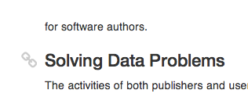

[Version history](https://github.com/jbenet/jbenet.github.com/commits/source/_posts/2014-03-05-add-links-to-headers.md).

I've always likes how [github](http://github.com) adds on-hover links to headers on their rendered markdown:

---


---
I couldn't find markdown renderers that included it. So, I wrote my post-processing js to make them. With any luck, this website should still show it in action. Below's the code.

## Here's the `js` (assumes [`$`](http://jquery.com/) and [`_`](http://underscorejs.org) are defined):

```js
$(document).ready(function() {

  // Modify this template to add or change links.
  var links = _.template('\
    <div class="header-links">\
      <a href="#<%= id %>"><i class="icon icon-link"></i></a>\
    </div>\
  ');

  // If your headers dont already have ids, use this slug fn
  var slugize = function(title) {
    return title.toLowerCase()
      .replace(/[^\w ()]+/g,'')
      .replace(/ +/g,'-');
  }

  // Modify the ':header' selector to apply to other elems
  $(':header').each(function(i, h) {

    // Add an id, if it doesn't have one.
    if (!$(h).attr('id')) {
      var id = $(h).text().replace(/[^A-Za-z0-9_]+/g, '-')
      id = id.replace(/^-+|-+$/g, '')
      $(h).attr('id', slugize($(h).text()));
    }

    // Add the link div
    $(h).append($(links({
      id: $(h).attr('id')
    })));
  });
});
```

## Here's the `less` (assumes FontAwesome icons `css`):

```less
h1, h2, h3, h4, h5, h6 {
  &:hover .header-links a {
    text-decoration: none;
    opacity: 0.4;
    color: gray;
  }

  .header-links {
    float: left;
    text-align: right;
    margin-left: -40px;
    padding-right: 10px;
    width: 40px;

    a {
      text-decoration: none;
      opacity: 0.0; // show on hover
      color: gray;
    }

    a:hover, a:active, a:focus {
      text-decoration: none;
      opacity: 0.6;
      color: #428bca;
    }
  }
}
```

## And it looks like this:

---

