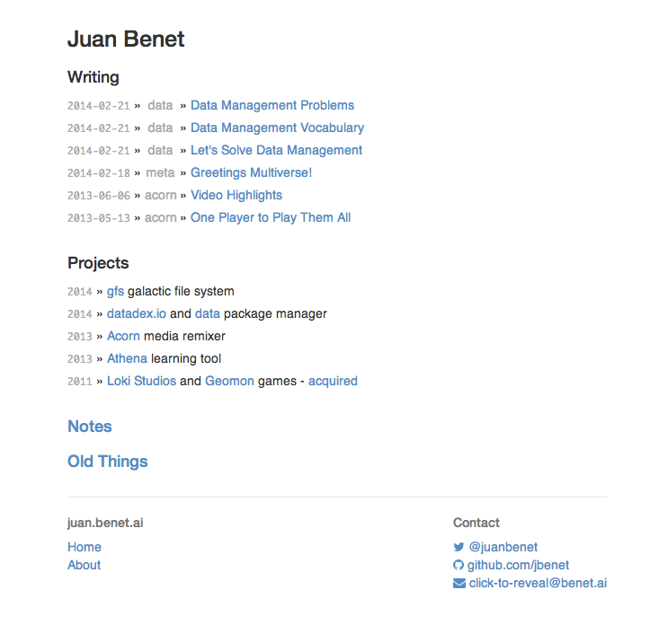
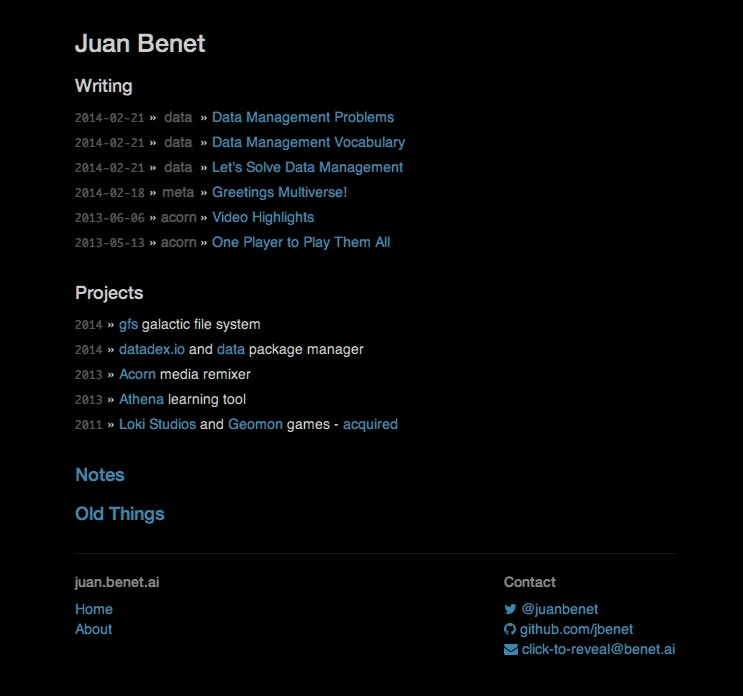

People ask me why my websites are "so light"
([athena](http://engine1.athena.ai), [acorn](http://acorn.athena.ai),
[juan.benet.ai](http://juan.benet.ai), [datadex.io](http://datadex.io))
when my computer is usually dark, from a shell or text editor. Well...

First, [white](http://github.com)
[websites](http://amazon.com)
[seem](http://pinterest.com)
[to](http://wikipedia.org)
[work](http://youtube.com)
[better](http://linkedin.com)
[in](http://flickr.com)
[the](http://facebook.com)
[mainstream](http://google.com)
([sorry](http://myspace.com),
[guys](http://rapgenius.com)).

And second, I don't. I actually design my websites to be black for me.
I use [Nocturne](https://code.google.com/p/blacktree-nocturne/),
which inverts the colors + hues of my display.

So when you see:

I see:

This works out great: I get black "easy on the eyes" websites that the
rest of the world will like.

Nocturne is great. Try it out. I recommend toggling it with a hotkey
(or with Alfred/Spotlight: `Alt+Space -> n -> enter`). Though be warned: it's
[broken in Mavericks](https://www.bountysource.com/issues/1430592-hue-inversion-does-not-work-on-mac-os-x-10-9-mavericks),
and it makes pictures of people look absolutely terrifying.
